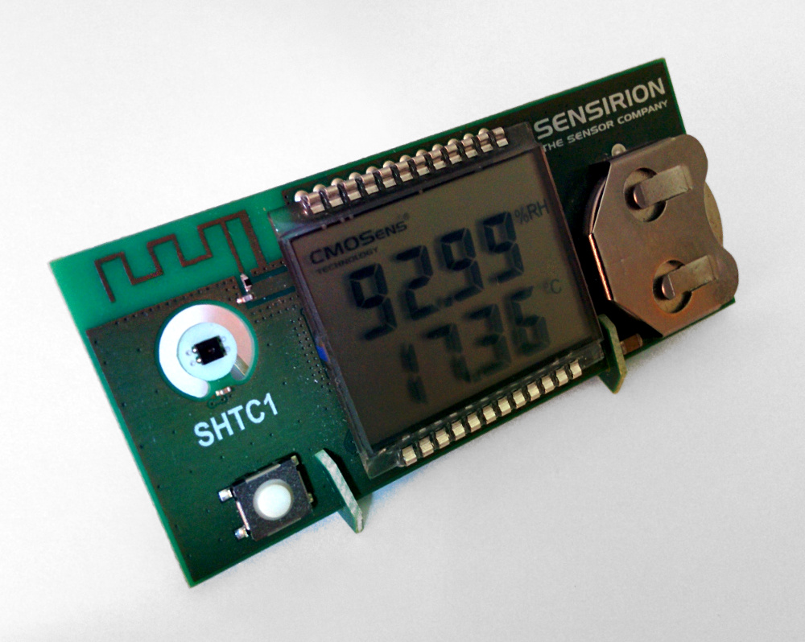
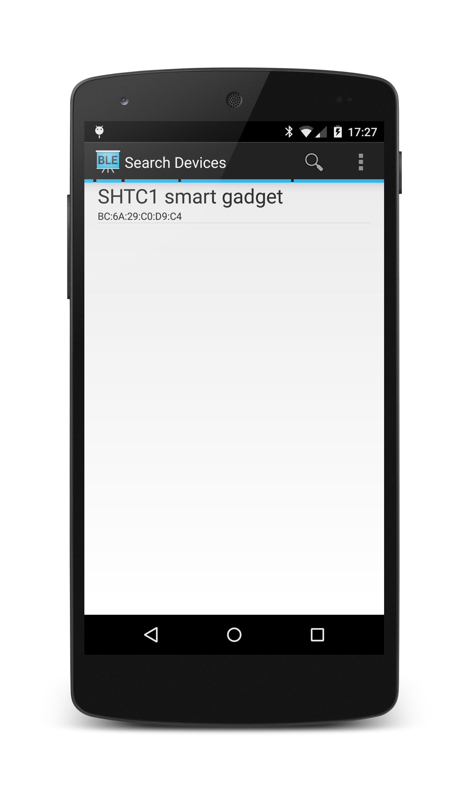
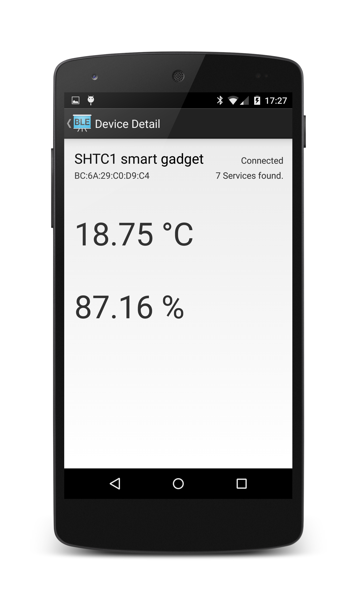

# Blutooth Low Energy experiment
Assignment 1.3, for [Distributed Systems HS 2014]( http://www.vs.inf.ethz.ch/edu/vs/)

This is a sensirion sensor gadget, with included BLE capability:

To access it via Bluetooth, this app was built.
You can download a debug build [here](ao-debug.apk).

Screenshots:

